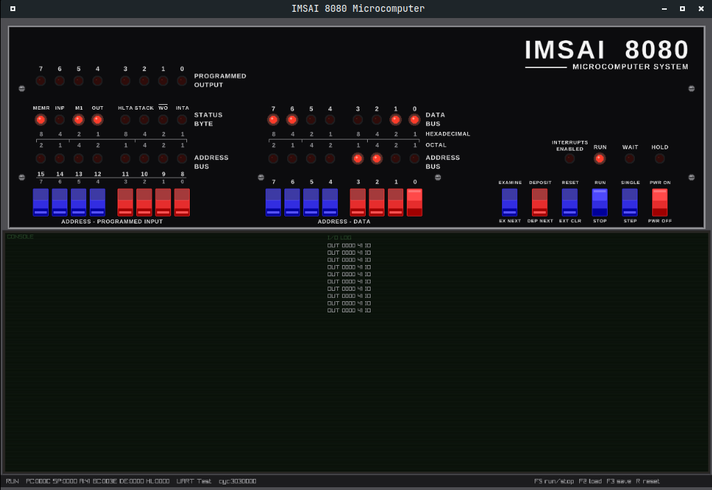

# IMSAI 8080 Emulator

A Rust emulator for the IMSAI 8080 with a Tarbell FD1771 floppy controller and raylib front panel GUI (toggle switches, LEDs, console display).



## What It Does

Emulates the IMSAI 8080 hardware: Intel 8080 CPU, 64KB RAM, Tarbell FD1771 floppy disk controller, and IMSAI SIO-2 dual serial board. Supports interactive terminal mode (CLI) and a visual front panel GUI.

**Current status**: Boots and runs programs loaded via `--load` or `--program`. Terminal mode provides interactive keyboard input and console output. Disk images can be mounted and the FD1771 controller is modeled, but there is no disk boot loader yet.

## Hardware Emulated

- Intel 8080 CPU ([rust-intel8080-emulator](https://github.com/andrewthecodertx/rust-intel8080-emulator))
- 64KB RAM (0xFF on power-up, matching floating bus behavior)
- Tarbell 1011 floppy disk controller (FD1771, 8" SSSD, ports 0x48-0x4B)
- IMSAI SIO-2 dual serial board (2x Intel 8251A UART, ports 0x00-0x03)
- IMSAI 8080 front panel (toggle switches, LEDs, function buttons)
- S-100 bus connecting all components

## Front Panel GUI

The `imsai-gui` binary provides a visual raylib front panel:

```bash
cargo run --bin imsai-gui
```

Defaults to empty memory (all addresses = 0xFF), matching a powered-on IMSAI with no software. Use the program loader (F2) or command-line flags to load software before pressing F5 to run.

Memory state is automatically saved to `imsai_memory.json` on exit and restored on the next launch. Press R to cold-reset (clears memory and deletes the saved state).

| Flag                     | Description                                         |
| ------------------------ | --------------------------------------------------- |
| (none)                   | Start with empty memory, STOPPED                    |
| `--bare`                 | Same as default (kept for compatibility)            |
| `--load <file> [0xADDR]` | Load raw binary file at address (default 0x0000)    |
| `--disk <file>`          | Mount disk image in drive A                         |
| `--program <file>`       | Load and execute a front panel program (.json)       |

### Front Panel Programs

Programs are JSON files describing sequences of switch positions and button presses, just like operating the real front panel. Create them in the `programs/` directory.

```json
{
  "name": "UART Test",
  "description": "Prints 'A' continuously to the UART",
  "steps": [
    { "action": "deposit", "address": "0000", "data": "3E" },
    { "action": "deposit_next", "data": "4E" },
    { "action": "deposit_next", "data": "D3" },
    { "action": "deposit_next", "data": "01" },
    { "action": "run", "address": "0000" }
  ]
}
```

Step types:

| Action         | Fields            | Effect                                                   |
| -------------- | ----------------- | -------------------------------------------------------- |
| `deposit`      | `address`, `data` | Set address and data switches, press DEPOSIT             |
| `deposit_next` | `data`            | Set data switches, press DEPOSIT NEXT (auto-advances)    |
| `examine`      | `address`         | Set address switches, press EXAMINE                      |
| `examine_next` | (none)            | Press EXAMINE NEXT (auto-advances)                       |
| `run`          | `address`         | Set address switches, press RUN/STOP                    |
| `load`         | `address`, `data` | Load hex bytes directly into memory (no switch toggling) |

The `load` action is a shortcut that writes bytes via `load_program()` instead of toggling each byte through the front panel. Use it for longer programs. The other actions operate the front panel interface exactly as a human would.

```bash
# Run the UART test program
cargo run --bin imsai-gui -- --program programs/uart-test.json

# Run the Hello World program
cargo run --bin imsai-gui -- --program programs/hello-world.json
```

### Front Panel Controls

| Control                         | Action                                              |
| ------------------------------- | --------------------------------------------------- |
| Mouse click on address switches | Toggle address bits (A15-A0)                        |
| Mouse click on data switches    | Toggle data bits (D7-D0)                            |
| RUN/STOP button or F5           | Start/stop CPU execution                            |
| STEP button                     | Execute one instruction                             |
| EXAMINE button                  | Read byte at address switches into data LEDs        |
| DEPOSIT button                  | Write data switches into memory at address switches |
| EX NXT / DEP NXT                | Increment address then examine/deposit              |
| F2                              | Open program loader (pick a `.json` from `programs/`) |
| F3                              | Save current memory region as a front panel program |
| F4                              | Mount a disk image in drive A                       |
| R key                           | Cold reset (clear RAM, delete `imsai_memory.json`) |
| Keyboard (when running)         | Send characters to console UART                    |

### Terminal Mode (CLI)

```bash
cargo run --bin imsai-cli -- --program programs/hello-world.json
```

Interactive terminal mode with keyboard input and live console output. Memory state is persisted between sessions via `imsai_memory.json`.

```
imsai-cli [OPTIONS]

Mode (choose one):
  --load <file> [addr]       Load raw binary at address (default 0x0000)
  --program <file.json>      Load a front panel program (.json)
  (no arguments)             Start with saved memory (or empty if first run)

Options:
  --disk <file>              Mount disk image in drive A
  (default)                  Interactive terminal mode with keyboard input
  --batch, -b                Batch mode (non-interactive, 50M instructions)
  --trace, -t                Trace every instruction
  --vtrace, -v               Verbose trace (with I/O logging)
  --diag, -d                 Diagnostic mode (I/O log + region tracking)
  --step, -s                 Step trace (first 500 instructions)
  --pctrace, -p              PC ring-buffer trace (last 8K instructions)
  --script                   Scripted mode (captures console output)
  --cmd "text"               Pre-load keyboard input for scripted testing
```

## Terminal Controls

| Key       | Action                                  |
| --------- | --------------------------------------- |
| Letters   | Sent as uppercase                      |
| Enter     | Sends CR (0x0D)                         |
| Backspace | Sends DEL (0x7F)                        |
| Tab       | Sends TAB (0x09)                        |
| Escape    | Sends ESC (0x1B)                        |
| Ctrl+key  | Sends control character (Ctrl+C = 0x03) |
| F5        | Start/stop CPU execution                |
| Ctrl+K    | Command mode (load, program, mount, go/run, reset, quit, help) |
| Ctrl+D    | Exit emulator                           |

## Known Limitations

- Only 8" SSSD floppy format (77 tracks, 26 sectors, 128 bytes/sector)
- No cycle-accurate timing
- Serial I/O polling only (no interrupt-driven input)
- No disk boot loader yet (disks mount and the FD1771 is modeled, but the machine cannot boot from disk)

## License

MIT, see [LICENSE](LICENSE).

## Contributing

PRs welcome. Please open an issue first for major changes.